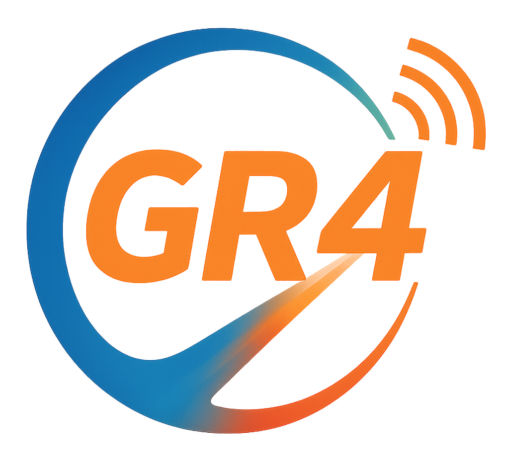

<p align="center">

</p>

[](LICENSE)
[](https://github.com/gnuradio/gnuradio4-core/actions/workflows/ci-main.yml)
[](https://github.com/gnuradio/gnuradio4-core/actions/workflows/ci-macos.yml)
[](https://github.com/gnuradio/gnuradio4-core/actions/workflows/sdk-image.yml)

# GNU Radio 4.0 Core

`gnuradio4-core` contains the GNU Radio 4 core runtime, scheduler, graph, block
model, plugin support, public core headers, blocklib code-generation SDK, and
installed CMake package surface used by downstream GNU Radio 4 repositories.

GNU Radio is a free and open-source signal processing runtime and signal
processing software development toolkit. Originally developed for use with
software-defined radios and for simulating wireless communications, its runtime
has found use in hobbyist, academic, and commercial environments.

This repository is not the full top-level GNU Radio 4 development tree.
Standard blocks and reusable DSP libraries are maintained in downstream
repositories that build against an installed core SDK:

- `gnuradio4-core`: runtime, scheduler, graph, block model, plugin support, and blocklib SDK
- `gnuradio4-library`: reusable non-block DSP libraries built on core
- `gnuradio4-blocks`: standard GNU Radio 4 blocks built on core and library

## Building

GNU Radio 4 core uses modern C++ (C++23), and is tested for

- CMake (>= 3.27),
- GCC (>=14, recommended: >=15)
- Clang (>=20, recommended), and
- Emscripten (5.0.2).

**To build the core runtime**:

```bash
git clone https://github.com/gnuradio/gnuradio4-core.git
cd gnuradio4-core

# (Optional) If you experience excessive gcc memory usage during builds (needs sudo):
sudo ./enableZRAM.sh

cmake -S . -B build \
  -DCMAKE_BUILD_TYPE=RelWithAssert \
  -DGR_ENABLE_BLOCK_REGISTRY=ON
cmake --build build --parallel
ctest --test-dir build --output-on-failure
```

**Cleaning up zram** if used:

```bash
sudo swapoff /dev/zram0
echo 1 | sudo tee /sys/block/zram0/reset
```

### Key CMake Flags `-D...=<ON|OFF>`

- **`GR_ENABLE_BLOCK_REGISTRY`** (default: ON): enables a runtime registry of blocks.
  Turning this off gives fully static builds.
- **`EMBEDDED`** (default: OFF): reduces code size and runtime features for constrained systems.
  Also implicitly enabled by `-DCMAKE_BUILD_TYPE=MinSizeRel`.
- **`WARNINGS_AS_ERRORS`** (default: ON): treats all compiler warnings as errors (`-Werror`).
- **`TIMETRACE`** (default: OFF): activates Clang’s `-ftime-trace` for per-file compilation timing.
- **`ADDRESS_SANITIZER`** (default: OFF): enables AddressSanitizer (can’t be combined with the other sanitizer options).
- **`UB_SANITIZER`** (default: OFF): enables 'Undefined Behavior' checks.
- **`THREAD_SANITIZER`** (default: OFF): enables threading checks (N.B. strong impact on performance).

### Example Combined Command

```bash
cmake -B build -S . \
  -DCMAKE_BUILD_TYPE=RelWithAssert \
  -DGR_ENABLE_BLOCK_REGISTRY=ON \
  -DWARNINGS_AS_ERRORS=ON \
  -DTIMETRACE=OFF \
  -DADDRESS_SANITIZER=OFF \
  -DUB_SANITIZER=OFF \
  -DTHREAD_SANITIZER=OFF
cmake --build build -- -j$(nproc)
```

Feel free to tweak these flags based on your needs (embedded targets, debugging, sanitizing, etc.).
For more details, see [DEVELOPMENT.md](DEVELOPMENT.md) or comments in the `CMakeLists.txt` file that
describe how to set up a local development environment.

## Downstream Repositories

Downstream block and library repositories must consume an installed core SDK
rather than source-tree paths from this repository. Core code and public core
headers must not depend on downstream library or block repositories.

In the split layout:

- `gnuradio4-library` may depend on the installed core SDK.
- `gnuradio4-blocks` may depend on the installed core SDK and `gnuradio4-library`.
- External blocklib repositories should use the installed `gnuradio4` and
  `GnuRadioBlockLib` CMake packages, including the installed
  `gnuradio_4_0_parse_registrations` tool.

```bash
cmake --install build --prefix "$HOME/gr4-core"
cmake -S /path/to/downstream -B /path/to/downstream/build \
  -DCMAKE_PREFIX_PATH="$HOME/gr4-core"
```

The CI-built SDK image is documented in [docs/ci/sdk-image.md](docs/ci/sdk-image.md).

On pushes to `main`, `.github/workflows/sdk-image.yml` publishes profile-tagged
core SDK images to GHCR:

```text
ghcr.io/<owner>/gnuradio4-core-sdk:<sha-or-main>-<profile>
```

Downstream repositories should consume matching profile tags:

- `gnuradio4-library` builds and tests against `gnuradio4-core-sdk`.
- `gnuradio4-library` publishes `gnuradio4-library-sdk`.
- `gnuradio4-blocks` builds and tests against `gnuradio4-library-sdk`, which
  already contains the matching core SDK.

Use profile-specific tags such as `main-ubuntu-26.04-gcc-release` rather than a
generic `main` tag. The generic tag is intentionally not published because the
SDK workflow runs a matrix and a shared tag would be a race.

Standard-block and library-dependent tests and benchmarks that previously lived
under `core/test` and `core/benchmarks` should live in `gnuradio4-blocks`,
`gnuradio4-library`, or a cross-repository integration test suite as
appropriate.

## What's In Core?

GNU Radio 4.0 is a major modernization of the GNU Radio runtime, block model,
and application architecture. This repository provides the core pieces needed to
build signal-processing systems from reusable blocks and flowgraphs while
keeping standard blocks and reusable DSP libraries in downstream repositories.

- **Runtime and Graph Model**: Blocks, ports, flowgraphs, schedulers, buffers,
  tags, messages, settings, and lifecycle support.

- **Modern C++ Block Development**: C++23 APIs and compile-time reflection make
  block development direct, type-safe, and maintainable.

- **Blocklib SDK**: Installed CMake packages, code-generation macros, and the
  `gnuradio_4_0_parse_registrations` tool for out-of-tree block libraries.

- **Plugin Infrastructure**: Core plugin loading and block registry support for
  runtime discovery of installed block libraries.

- **High-Performance Runtime Primitives**: Efficient buffers, compile-time
  optimization hooks, SIMD support, and flexible scheduling infrastructure.

- **Portable SDK Surface**: CI validates multiple Linux compiler/container
  profiles plus Emscripten and macOS coverage where supported.

## License and Copyright

Unless otherwise noted: SPDX-License-Identifier: MIT<br>
All code contributions to GNU Radio core and runtime are integrated under the
MIT License, ensuring the core remains free/libre for personal, academic, and
commercial use. Downstream block and library repositories may define their own
compatible licensing policy.
For details on these distinctions and how to contribute, please consult: [CONTRIBUTING.md](CONTRIBUTING.md)

Copyright (C) The GNU Radio Authors<br>
Copyright (C) Contributors to the GNU Radio Project<br>
Copyright (C) FAIR - Facility for Antiproton & Ion Research, Darmstadt, Germany<br>

## Acknowledgements

The GNU Radio project appreciates the contributions from GSI/FAIR in the co-development of GNU Radio 4.0. Their dedicated efforts have played a key role in enhancing the capabilities of our open-source SDR technology.
We also recognize the broader GNU Radio community and all contributors whose
work shaped the core runtime that evolved into GNU Radio 4.0.

## Helpful Links

- [GNU Radio Website](https://gnuradio.org)
- [GNU Radio Wiki](https://wiki.gnuradio.org/)
- [GitHub issue tracker for core bug reports and feature requests](https://github.com/gnuradio/gnuradio4-core/issues)
- [View the GNU Radio Mailing List Archive](https://lists.gnu.org/archive/html/discuss-gnuradio/)
- [Subscribe to the GNU Radio Mailing List](https://lists.gnu.org/mailman/listinfo/discuss-gnuradio)
- [GNU Radio Chatroom on Matrix](https://chat.gnuradio.org/)
  - Specifically for discussions related to GNU Radio 4.0 join the [#architecture channel](https://matrix.to/#/#gr4-technical-users:gnuradio.org)
